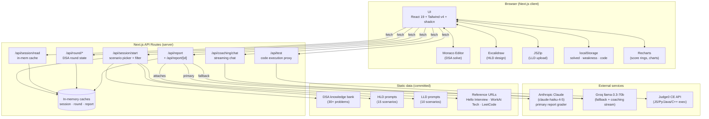

# InterviewFlow

> A serious training ground for staff-bound engineers. Real coding, real system design, real critique — under real time. No flashcards, no fluff, no "ace it in 7 days" promises.

InterviewFlow is an AI-graded SDE interview-prep platform with three timed tracks (DSA, HLD, LLD), a curated problem bank, and a critique pipeline that scores submissions across correctness, clarity, trade-offs, scalability, and code quality.

**Status:** v1 — anonymous, single-device, no signup required.

---

## ✦ Features

- **Three tracks**, each with its own pacing and submission format:
  - **DSA** — Monaco editor, four languages (JS / Python / Java / C++), Judge0-executed test cases, 20–45 min timer
  - **HLD** — Excalidraw canvas + structured 5-section design template, 45 min timer
  - **LLD** — Local-IDE workflow with `.zip` upload (multi-file repo critique), 60 min timer
- **AI-graded reports** — radial score rings, strengths / issues / improvements / missing, optimal-approach reveal, follow-up questions, similar problems, weak-topic radar, in-report coaching chat
- **Reference articles** — every report includes a "deep-dive" link to the canonical breakdown (Hello Interview for HLD, WorkAt Tech for LLD, LeetCode for DSA)
- **Dashboard** — anonymous, localStorage-backed view of solved counts per track, easy/medium/hard breakdown, recent attempts, weak-topic radar
- **Difficulty filter** — pick easy / medium / hard for HLD and LLD scenario pools
- **25 + 10 + curated** — 15 HLD scenarios, 10 LLD scenarios, 30+ DSA problems
- **No signup, no tracking, no nonsense** — everything lives in your browser's localStorage and on your local machine

---

## ✦ System Architecture



### Request flow per track

```mermaid
sequenceDiagram
    participant U as User
    participant Setup as /setup
    participant API as Next.js API
    participant AI as Claude / Groq
    participant Judge as Judge0
    participant Report as /report/&lbrack;id&rbrack;

    U->>Setup: pick experience + track + difficulty
    Setup->>API: POST /api/session/start
    API-->>Setup: {sessionId, scenario, duration}
    Setup->>U: redirect to /session/{type}

    alt DSA
        U->>API: POST /api/test (code + language)
        API->>Judge: submit + poll
        Judge-->>API: pass/fail per case
        API-->>U: test results
        U->>API: POST /api/report (problem + code)
    else HLD
        U->>U: draw on Excalidraw + fill 5 sections
        U->>API: POST /api/report (scenario + diagramDescription)
    else LLD
        U->>U: code locally, zip source
        U->>U: JSZip extracts source files in browser
        U->>API: POST /api/report (scenario + combined code)
    end

    API->>AI: generate report (JSON schema)
    AI-->>API: scored report
    API-->>U: redirect to /report/{sessionId}
    Report->>API: GET /api/report/{sessionId}
    API-->>Report: full report (with referenceUrl)
    Report->>U: render rings, panels, optimal code, reference card
```

---

## ✦ Tech Stack

| Layer | Choice | Why |
|---|---|---|
| **Framework** | Next.js 16.2.4 (Turbopack, App Router) | Modern App Router, fast dev, edge-ready API routes |
| **UI** | React 19.2 + Tailwind v4 + shadcn/ui + Lucide | Composable primitives, dark-mode polish |
| **Charts** | Recharts | Animated radial score rings + bar charts |
| **Editors** | Monaco (DSA), Excalidraw (HLD) | Premium tooling feel; both lazy-loaded |
| **Archive** | JSZip (browser) | Multi-file LLD submissions parsed client-side |
| **AI grading** | Anthropic Claude (`claude-haiku-4-5-20251001`) primary, Groq (`llama-3.3-70b-versatile`) fallback | Strict JSON-schema output for report shape; Groq for low-latency coaching stream |
| **Code exec** | Judge0 CE (`https://ce.judge0.com`) | Sandboxed JS / Python / Java / C++ |
| **Persistence** | localStorage (client) + in-memory cache (server) | Anonymous v1; Supabase swap planned for v2 |

---

## ✦ Project Structure

```
src/
├── app/
│   ├── page.tsx                # Landing
│   ├── setup/page.tsx          # Session config (track + experience + difficulty)
│   ├── dashboard/page.tsx      # Solved counts + weak topics (3 track blocks)
│   ├── session/
│   │   ├── [type]/page.tsx     # Type router (redirects to read/round)
│   │   ├── dsa/round/page.tsx  # DSA round overview
│   │   ├── dsa/solve/page.tsx  # Monaco editor + Judge0 tests
│   │   ├── hld/read/page.tsx   # HLD problem + hints
│   │   ├── hld/design/page.tsx # Excalidraw canvas + 5-section template
│   │   ├── lld/read/page.tsx   # LLD problem + guidelines
│   │   └── lld/solve/page.tsx  # Zip upload + extraction
│   ├── report/[sessionId]/page.tsx  # AI-graded report
│   └── api/
│       ├── session/{start,read,complete}
│       ├── round/{create,read,update,report}
│       ├── report/{,[sessionId]}
│       ├── test                  # Judge0 proxy
│       ├── coaching/chat         # Groq streaming
│       └── problems/{batch,daily}
├── components/
│   ├── session/                  # MonacoEditor, ExcalidrawCanvas, HLDTemplate, TestCasePanel, SessionTimer, ProblemStatement, etc.
│   ├── report/                   # TimeAnalysis · FollowUp · CompanyTags · SimilarProblems · Weakness · Coaching panels
│   └── ui/                       # shadcn primitives (button, card, badge, skeleton, …)
├── lib/
│   ├── claude.ts                 # Anthropic client + DSA/HLD/LLD report builders
│   ├── groq.ts                   # Groq client (fallback + coaching stream)
│   ├── session.ts                # HLD_PROMPTS · LLD_PROMPTS · TIMER_CONFIG
│   ├── dsa-knowledge-bank.ts     # Curated DSA bank (30+ problems with rotation)
│   ├── solved-tracker.ts         # localStorage solved history + track derivation
│   ├── weakness-tracker.ts       # localStorage weakness ledger
│   ├── round-cache.ts            # In-memory DSA round state
│   ├── report-cache.ts           # In-memory report cache
│   ├── piston-harness.ts         # Per-language test harness templates
│   ├── problem-stubs.ts          # Per-language code skeletons
│   ├── hld-hints.ts              # Design hints per HLD scenario
│   ├── rag-retrieval.ts          # Similar-problem scoring
│   └── data.ts                   # File-system data helpers
└── types/index.ts                # SessionReport · HLDScenario · LLDScenario · Problem · …
```

---

## ✦ Quick Start

```bash
# 1. Install
npm install

# 2. Configure environment
cp .env.example .env.local
# edit .env.local — at minimum, set ANTHROPIC_API_KEY

# 3. Run dev server
npm run dev
# → http://localhost:3000

# 4. Production build
npm run build
npm start
```

### Environment variables

| Variable | Required | Purpose |
|---|---|---|
| `ANTHROPIC_API_KEY` | **Yes** (or Groq) | Primary AI grader (Claude Haiku 4.5) |
| `GROQ_API_KEY` | recommended | Fallback grader + low-latency coaching chat stream |
| `CLI_DATA_PATH` | optional | Path to a sibling `interview-prep/` data dir for daily-problem helpers |
| `NEXTAUTH_URL` | optional | Used by `/api/session/start` to call its own cache endpoint server-side |

If neither `ANTHROPIC_API_KEY` nor `GROQ_API_KEY` is set, report generation falls back to a static placeholder so the UI still renders end-to-end.

---

## ✦ Development log (v1)

What got built getting here, in rough chronological order:

1. **Question bank expansion** — scraped Hello Interview (HLD) and WorkAt Tech (LLD); HLD: 8 → 15 prompts, LLD: 3 → 10 prompts; all labeled `easy` / `medium` / `hard`.
2. **Difficulty filter** — `/api/session/start` accepts `difficulty: string[]`, `/setup` ships a chip-group UI, end-to-end handoff fixed (was being dropped by the `[type]` redirect).
3. **Bug-fix wave** — 8 bugs squashed:
   - missing `generateLLDReport` export (500s on LLD report)
   - `timeTakenMinutes === 0` rejected as missing field
   - HLD form submitted with all-blank fields silently
   - report page crashed on partial / older reports
   - LLD `allocatedMinutes` not rounded
   - cache-miss showed dead-end "Failed to Load"
   - no logging on malformed AI JSON
   - difficulty filter dropped during type-page redirect
4. **Design overhaul** — landing, setup, report (main + score rings + insight cards + time-analysis + follow-up panels) rebuilt to production-grade dark-theme aesthetic with mk-* utility system. Session-flow pages kept original styling for v1 (will iterate after friend feedback).
5. **Reference article links** — every HLD / LLD / DSA scenario carries a `referenceUrl`; the report renders a "Read the reference breakdown" CTA that opens Hello Interview / WorkAt Tech / LeetCode in a new tab.
6. **Dashboard** — `/dashboard` page with 3 track blocks (DSA · HLD · LLD), each showing total solved count + animated easy/medium/hard breakdown bars + recent attempts list. Weak-topic radar, stats strip, empty-state CTA. All driven by localStorage; ready to swap to Supabase in v2.

---

## ✦ Credits

This project leans on excellent published interview content. Reference articles in the report attribute back to the original authors:

- **Hello Interview** — system-design problem breakdowns ([hellointerview.com](https://www.hellointerview.com/learn/system-design/problem-breakdowns/overview))
- **WorkAt Tech** — machine-coding (LLD) problems ([workat.tech/machine-coding](https://workat.tech/machine-coding/practice))
- **LeetCode** — DSA problem statements

We curate, time, and AI-grade — but the canonical walkthroughs live with the original authors. If you got value from a problem, follow the link in the report.

---

## ✦ Roadmap (post-v1)

- **Persistence** — Supabase (Postgres + auth) → reports survive deploys, dashboard becomes cross-device
- **Anonymous → identified** — magic-link or Google OAuth, opt-in only
- **Behavioral round** — STAR-format prompts with structured grading
- **Full-mock combo** — 90-min back-to-back coding + design + behavioral
- **Mobile responsive pass** — current build is desktop-first
- **Session-flow page redesign** — DSA solve, HLD design, LLD solve UI polish
- **Coaching/Weakness/Similar/CompanyTags panels** — visual polish to match the rest of the report

---

## ✦ License

MIT — see [LICENSE](LICENSE).
